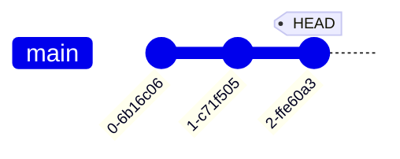
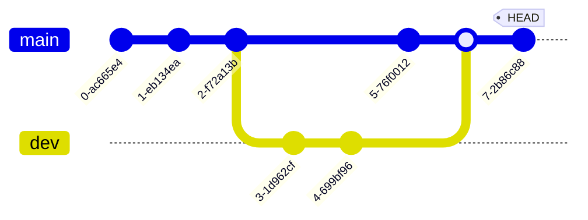
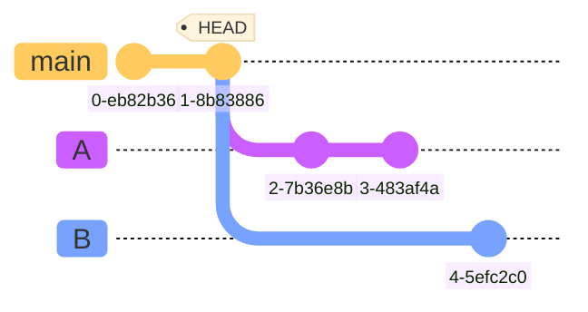
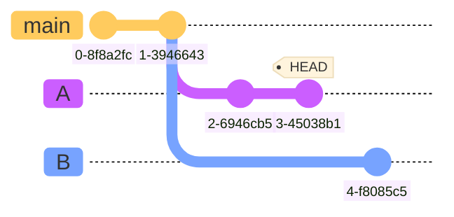
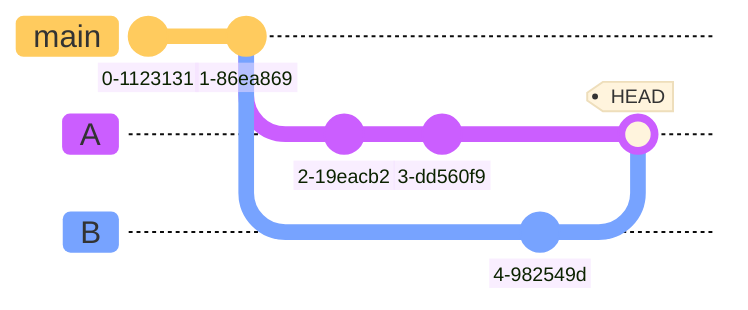

```mermaid
gitGraph
    commit
    commit
    commit tag: "HEAD"
```

```mermaid
gitGraph
    commit
    commit
    commit
    branch dev
    checkout dev
    commit
    commit
    checkout main
    commit
    merge dev
    commit tag: "HEAD"
```

```mermaid
---
config:
  theme: 'base'
  gitGraph:
    rotateCommitLabel: false
---

gitGraph
  commit
  commit tag: "HEAD"
  branch A
  branch B
  checkout A
  commit
  commit
  checkout B
  commit
  checkout main
```

```mermaid
---
config:
  theme: 'base'
  gitGraph:
    rotateCommitLabel: false
---

gitGraph
  commit
  commit
  branch A
  branch B
  checkout A
  commit
  commit tag: "HEAD"
  checkout B
  commit
  checkout main
```

```mermaid
---
config:
  theme: 'base'
  gitGraph:
    rotateCommitLabel: false
---

gitGraph
  commit
  commit
  branch A
  branch B
  checkout A
  commit
  commit
  checkout B
  commit
  checkout A
  merge B tag: "HEAD"
```
